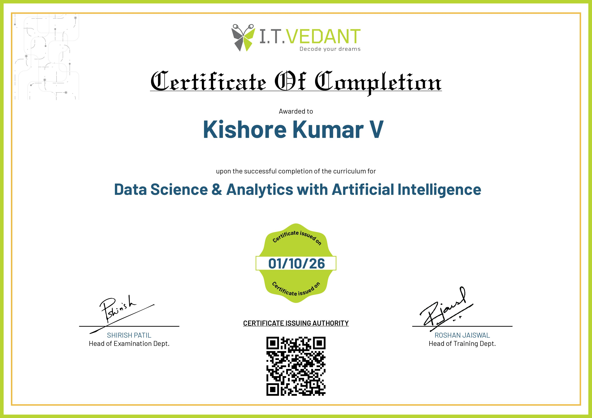
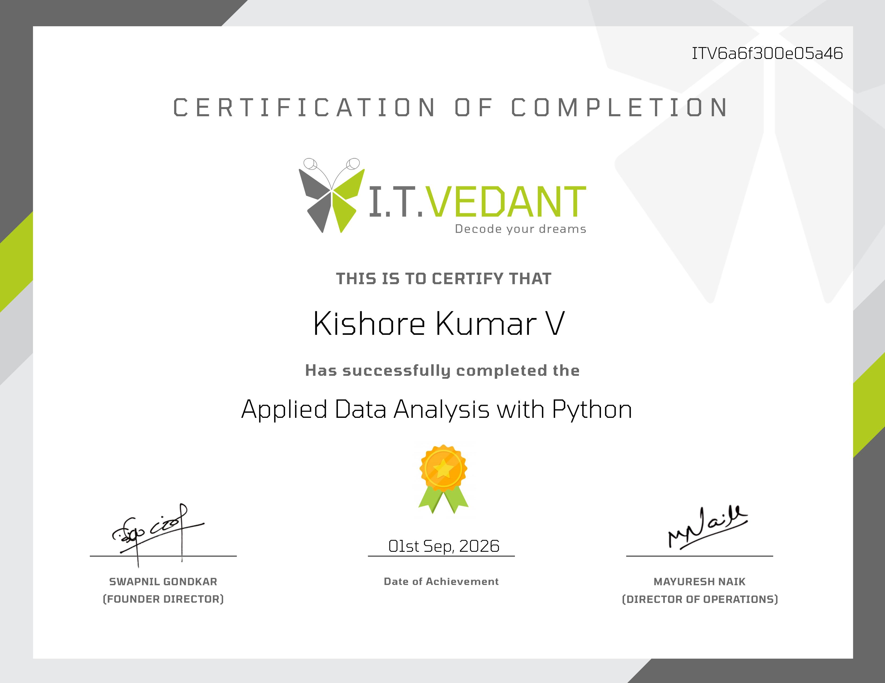
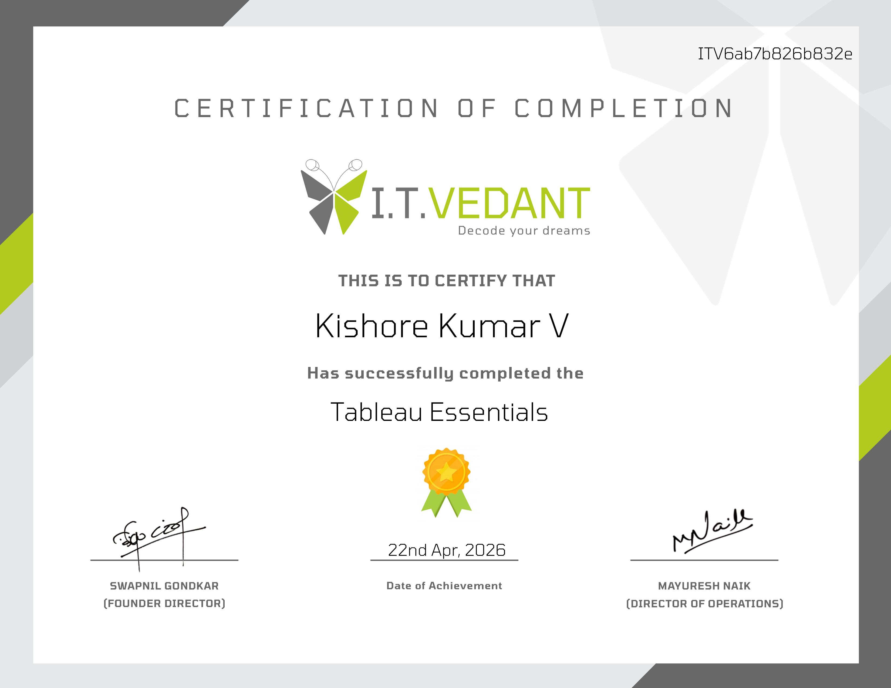
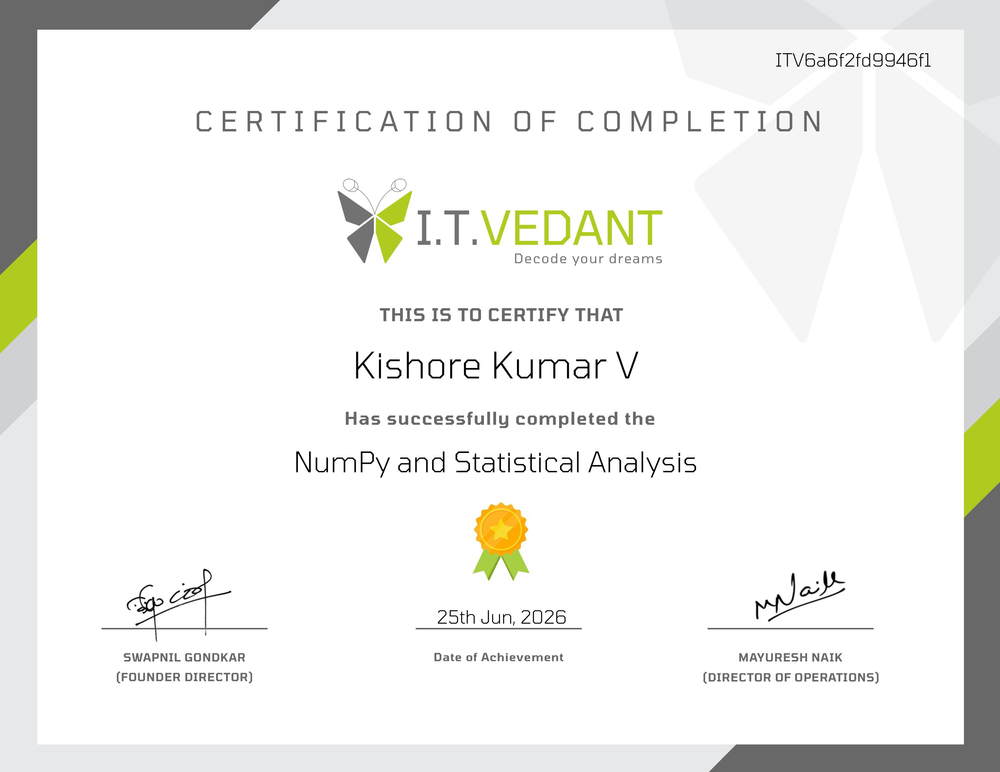

# certificates
# Certificates – Kishore Kumar V

Data Science & Analytics certifications from **IT Vedant**. Click any image to open it full size.

## Program Completion

**Data Science & Analytics with Artificial Intelligence**

## Module Certificates

<table>
<tr>
<td align="center"> <b>Machine Learning Mastery</b></td>
<td align="center"> <b>Applied Data Analysis with Python</b></td>
</tr>
<tr>
<td align="center"> <b>Python Essentials for Data Science</b></td>
<td align="center"> <b>SQL Mastery</b></td>
</tr>
<tr>
<td align="center"> <b>Power BI Essentials</b></td>
<td align="center"> <b>Tableau Essentials</b></td>
</tr>
<tr>
<td align="center"> <b>Advanced Excel</b></td>
<td align="center"> <b>NumPy and Statistical Analysis</b></td>
</tr>
</table>
